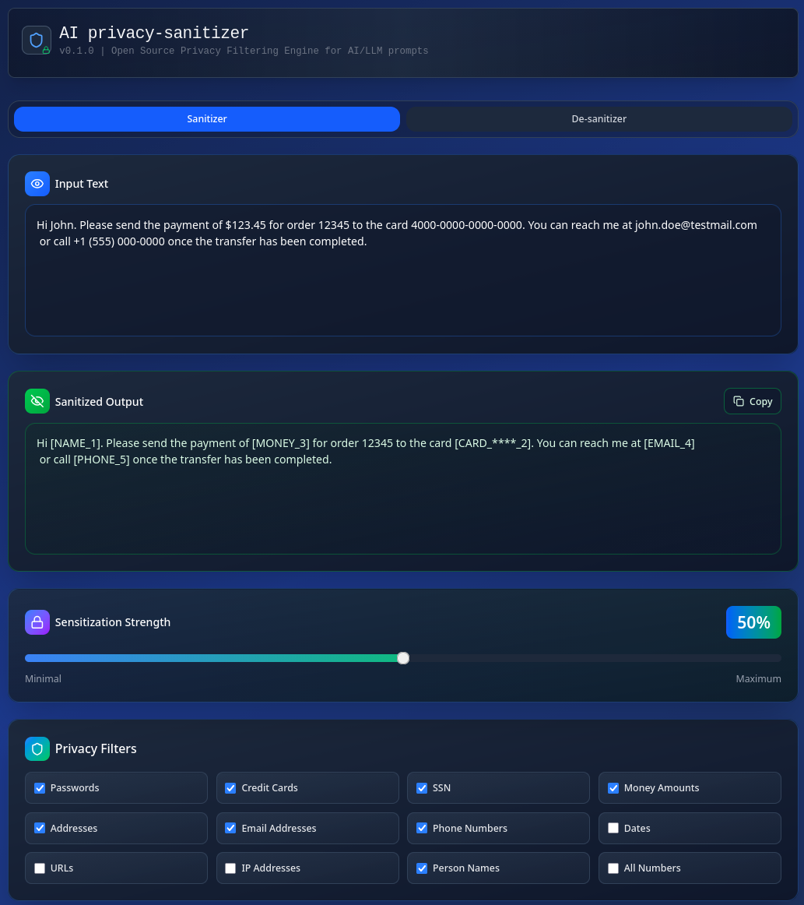
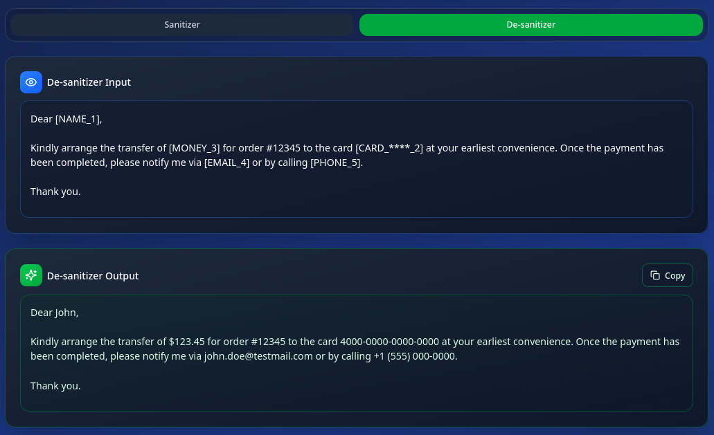

# AI Privacy Sanitizer App

Public URL: <https://valeriyc.github.io/AIPrivacySanitizer/>

## Usage instructions

1. Put your LLM prompt containing sensitive data into "Input Text" and copy "Sanitized Output" to the LLM:

Adjust Sanitization Strength / Privacy Filters if needed.

2. Put LLM output into De-sanitizer tab - "De-sanitizer Input" and get "De-sanitazed output": 



This is a code bundle for AI Privacy Sanitizer App. The original project is available at <https://www.figma.com/design/5GxbaLCLYEF21DNsubQ6SN/AI-Privacy-Sanitizer-App>.

## Running locally

1. Install dependencies:
   ```bash
   npm install
   ```
2. Start the development server:
   ```bash
   npm run dev
   ```

## GitHub Pages setup

This project is already configured for GitHub Pages with:

- `homepage` in `package.json`
- `predeploy` script (`npm run build`)
- `deploy` script (`gh-pages -d dist -a`)

Before your first deployment, make sure:

1. The repository is pushed to GitHub.
2. `package.json` has the correct `homepage` value:
   - `https://<your-github-username>.github.io/<your-repo-name>`
3. In GitHub repo settings, go to **Pages** and set:
   - **Source**: `Deploy from a branch`
   - **Branch**: `gh-pages` (root)

## Deploy to GitHub Pages

Run:

```bash
npm install
npm run deploy
```

This will build the app and publish the `dist` output to the `gh-pages` branch.

After deployment, your site will be available at the `homepage` URL.
  